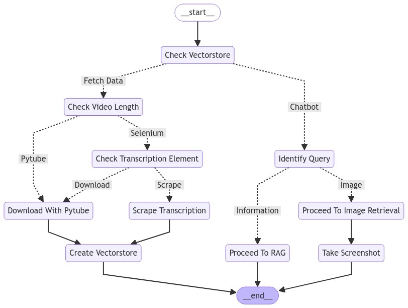

# TalkYou

TalkYou is an innovative open-source project designed to enable users to have a chat with any YouTube video. It brings you a customized chatbot experience, not only with the ability to chat but also with an amazing feature of image retrieval based on your queries.

## LangGraph Schema
We utilize both LangChain and LangGraph frameworks as the back-bone of this project to achieve conditional tool calling capabilities. The LangGraph schema below depicts the skeleton of the processes taking place under the hood,
however, to clarify;

* If Vectorstore exists:
    * The process moves directly to the "Chatbot" step.
    * The chatbot identifies the query.
    * If the query is for information:
      * Proceed to RAG (Retrieval-Augmented Generation)
    * If the query is for an image:
      * Proceed to Image Retrieval
      * Take a screenshot

* If Vectorstore doesn't exist:
  * Fetch Data
  * Check Video Length
  * If video is short (suitable for Pytube):
    * Download With Pytube
    * If video is long or Pytube is not suitable:
      * Use Selenium to Check Transcription Element
    * If transcription is available:
      * Scrape Transcription 
    * If transcription is not available: 
        * Download With Pytube
    * After either downloading or scraping: 
        * Create Vectorstore

This workflow demonstrates a sophisticated system for handling YouTube video data, 
capable of adapting to different scenarios such as existing data, video length, and query types. 
It incorporates various tools and techniques including Vectorstore for data storage, 
Pytube and Selenium for video handling, and capabilities for both information retrieval (RAG) and image processing 
utilized with metadata filtering.



## Features

- Chat with YouTube videos (Automized RAG-Pipeline)
- Image retrieval based on user queries (Metadata Filtering)

## Technology Stack
- Backend: FastAPI running in a containerized Docker image with Nvidia CUDA support
- Frontend: Streamlit (Python-based lightweight and fast framework) containerized Docker image
- Python:3.11
- LangChain:0.2.12
- LangGraph:0.2.3

## Quick Installation
Project installation is quite straight-forward. We utilized LangSmith for debugging and monitoring, thereon added tracing_v2_enabled context manager for agent invocation in `~/backend/backend_router.py`. If you do not wish to
wrap invocations with LangSmith context manager you can simply remove it. We use OPENAI models for LLMs (Whisper is hosted locally, with CUDA support), therefore you should either create .env file under `~/backend/` directory or
simply follow the below bash commands.

```bash
git clone https://github.com/dfavenfre/TalkYou.git
cd src
export OPENAI_API_KEY=<insert-your-own-api-key> # required
export LANGCHAIN_API_KEY=<insert-your-own-api-key> # required
docker compose up --build
```

Once the 'health check' API endpoint signals that all components of the network are up and running, navigate to the following links to access both the application and backend post-get service:

- [TalkYou Application](http://localhost:8501/)
- [FastAPI Swagger UI](http://localhost:8000/docs#/)

## Docker Commands

Use the following commands to manage Docker containers and images:

```bash
# Build Docker Compose file
docker compose build

# Run Docker images
docker compose up

# Kill all running Docker containers
ctrl+C

# Stop/shut-down all running Docker containers
docker compose down

# List existing Docker images
docker images -a

# Delete a Docker image
docker rmi <unique_id_of_the_docker_image>
```

## License

This project is licensed under the [MIT License](LICENSE).

## Authors

- [Tolga Şakar](https://www.linkedin.com/in/tolga-%C5%9Fakar-575b86136/)
- [Gülsüm Budakoğlu](https://www.linkedin.com/in/gulsumb/)

## Acknowledgments

- List any libraries, tools, or resources you'd like to acknowledge
- Give credit to inspirations or related projects

## Support

If you encounter any problems or have any questions, please open an issue in the GitHub repository.

